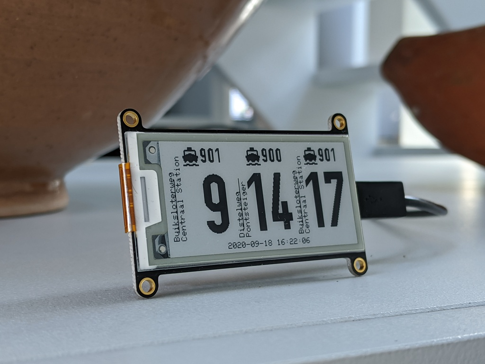
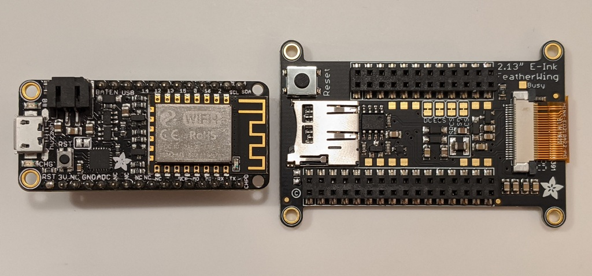

# OVertime

The Arduino sketch tracks the Netherlands public transit
("Openbaar vervoer" or "OV") on the using the GVB websocket interface
and display the results on an E-Ink screen.  The small screen shows
three upcoming events for the configured stops.

To customize it, edit `config.h` to add your WiFi ESSID and password,
and update the halt numbers with the ones from the https://maps.gvb.nl
website.

## Hardware

* [Adafruit Feather ESP8266](https://www.adafruit.com/product/3046)
* [Adafruit 2.13" monochrome E-Ink screen](https://www.adafruit.com/product/4195)

The ESP8266 is older and less featured than the ESP32, although it was
what I had on hand.  The code should be portable with a few fixes to the
newer architecture.

The E-Ink display works fine, although it doesn't have partial refresh,
so the entire screen flashes when updating.  Not as bad as the tri-color,
but still a bit messy.  The code could be updated for a different display
as well.

## Software

The last known build used Arduino 1.8.13 with esp8266 2.7.4 installed
via [the Board Mananger URL](https://arduino.esp8266.com/stable/package_esp8266com_index.json).

The libraries installed via the Library Manager are:

* [ArduinoJson](https://arduinojson.org/) 6.16.1
* [ArduinoWebsockets](https://github.com/gilmaimon/ArduinoWebsockets) 0.4.18
* [Adafruit EPD](https://github.com/adafruit/Adafruit_EPD) 2.5.3
* [Adafruit GFX](https://github.com/adafruit/Adafruit-GFX-Library) 1.10.1

The D-DIN font is from [Datto](https://www.1001fonts.com/d-din-font.html)
and is licensed under [SIL OFL](http://scripts.sil.org/OFL).

The [bus](https://www.materialui.co/icon/directions-bus), [tram](https://www.materialui.co/icon/directions-train), and [ferry](https://www.materialui.co/icon/directions-ferry) icons are from [Material UI](https://github.com/google/material-design-icons).

The GVB icon is from the GVB website.
